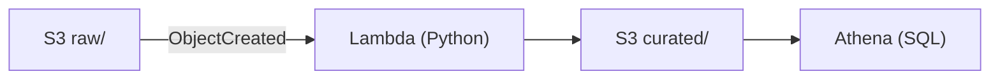

# aws-pipeline
Pipeline serverless: S3 (raw) → Lambda (transform) → S3 (curated) → Athena (Terraform + Python).

## Cómo probar (S3 → Lambda → S3 → Athena)
1. Subir CSV a `s3://daniel-pipeline-aws-2025/raw/ventas.csv`
2. Lambda genera `s3://daniel-pipeline-aws-2025/curated/ventas.csv`
3. Athena (us-east-1):
   ```sql
   CREATE DATABASE IF NOT EXISTS tienda;

   CREATE EXTERNAL TABLE IF NOT EXISTS tienda.ventas (
     fecha string,
     producto string,
     cantidad string,
     monto string
   )
   ROW FORMAT SERDE 'org.apache.hadoop.hive.serde2.OpenCSVSerde'
   WITH SERDEPROPERTIES ("separatorChar" = ",", "quoteChar" = "\"")
   LOCATION 's3://daniel-pipeline-aws-2025/curated/'
   TBLPROPERTIES ('skip.header.line.count'='1');

   ```

## Consulta ejemplo

```sql

SELECT producto,
       SUM(CAST(monto AS DOUBLE)) AS total
FROM tienda.ventas
WHERE TRY_CAST(monto AS DOUBLE) IS NOT NULL
GROUP BY producto
ORDER BY total DESC
LIMIT 10;

```

## Arquitectura



## Limpieza

```bash
cd infra
terraform destroy -auto-approve
```

2) “Prerequisitos” al inicio
   
```md
## Prerrequisitos
- Terraform ≥ 1.9
- AWS CLI v2 con credenciales válidas
- Región: `us-east-1`
```

## Estructura
```
.
├─ infra/              # Terraform (S3, Lambda, permisos, notificación)
├─ lambda/             # Código Python de la Lambda
├─ sample/             # CSV de ejemplo
└─ .github/workflows/  # CI
```
