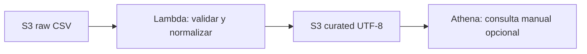

# AWS CSV pipeline — verificación local

Pipeline de demostración: S3 `raw/` → Lambda Python → S3 `curated/`. Terraform define almacenamiento, permisos, notificación y empaquetado. Athena puede consultar los CSV curados mediante la DDL ilustrativa siguiente; Terraform no crea tablas ni ejecuta consultas Athena.

## Probar sin cuenta AWS ni costos

Requisitos: Python 3.11+, Terraform 1.9+ para validación opcional.

```powershell
python -m venv .venv
.\.venv\Scripts\python.exe -m pip install -r requirements-dev.txt
.\.venv\Scripts\python.exe -m unittest discover -s tests -v
.\.venv\Scripts\python.exe scripts/demo_local.py
terraform -chdir=infra init -backend=false -input=false
terraform -chdir=infra fmt -check
terraform -chdir=infra validate
```

El demo transforma las cuatro filas ficticias de `sample/ventas.csv` a `.demo/ventas-utf8.csv`. No crea un cliente AWS. Las pruebas sustituyen S3 por un transporte en memoria. `terraform init` descarga providers oficiales; `validate` no despliega recursos. No se ejecutaron `plan`, `apply`, subidas S3 ni consultas Athena durante la revisión.

## Comportamiento

- Procesa todas las notificaciones S3 de un lote y decodifica claves URL, incluyendo espacios.
- Lee solo `raw/*.csv`; excluye salidas `curated/` y otras extensiones para evitar bucles.
- Convierte UTF-8/BOM y CP1252/LATIN1 a UTF-8 con saltos LF, conservando nombres y valores del CSV.
- Valida encabezados únicos/no vacíos y ancho de cada fila; limita archivos a cinco MB.
- Escribe también archivos con solo encabezados, evitando conservar una salida anterior con filas obsoletas.
- Cierra streams tanto en éxito como en error. La salida conserva la ruta relativa y añade MIME `text/csv`.

## Infraestructura revisada

El ZIP Lambda se deriva automáticamente del código mediante el provider Archive. Los nombres usan un prefijo configurable y S3 añade un sufijo único. IAM permite lectura en `raw/` y escritura en `curated/`, con permisos de CloudWatch para logs. El bucket bloquea acceso público, activa cifrado AES256/versionado y rechaza HTTP sin TLS. La invocación S3 se restringe a bucket/cuenta de origen.


```mermaid
graph LR
  A[S3 raw CSV] --> B[Lambda: validar y normalizar]
  B --> C[S3 curated UTF-8]
  C --> D[Athena: consulta manual opcional]
```

## DDL Athena ilustrativa

Sustituye `YOUR_GENERATED_BUCKET` por el nombre obtenido tras un despliegue autorizado. Esta instrucción no se ejecuta automáticamente:

```sql
CREATE EXTERNAL TABLE tienda_ventas (
  fecha string, producto string, cantidad string, monto string
)
ROW FORMAT SERDE 'org.apache.hadoop.hive.serde2.OpenCSVSerde'
WITH SERDEPROPERTIES ('separatorChar' = ',', 'quoteChar' = '"')
LOCATION 's3://YOUR_GENERATED_BUCKET/curated/'
TBLPROPERTIES ('skip.header.line.count'='1');
```

## Límites y evidencia

Verificado en Windows con Python3.14.3/Terraform1.9.8: siete tests de transformación/handler pasan; configuración Terraform válida y formato correcto. CI ejecuta pruebas reales y validación Terraform. No se afirma un despliegue cloud verificado ni costo cero al desplegar: S3, Lambda, logs y Athena pueden facturar.

No hay servicio de autenticación de usuarios, catálogo Glue provisionado, alarmas, DLQ ni política de retención automática. Un error de CSV hace fallar la invocación; S3/Lambda pueden repetirla y escribir una nueva versión. El CSV normaliza codificación y estructura; no realiza validación semántica de importes ni de fechas. Los exports no están preparados para apertura confiada en Excel si la entrada contiene fórmulas.

Nunca añadas credenciales, `.tfstate`, `.terraform/`, `.env`, ZIP generado ni `.demo/` a Git. Los backups y el estado remoto deben definirse antes de un despliegue. Las operaciones de eliminación requieren revisar el plan y preservar objetos/versiones; no se proporciona un comando automático de destrucción.

MIT. Proyecto de demostración; la verificación local y sus limitaciones deben acompañar la presentación en el portafolio.
